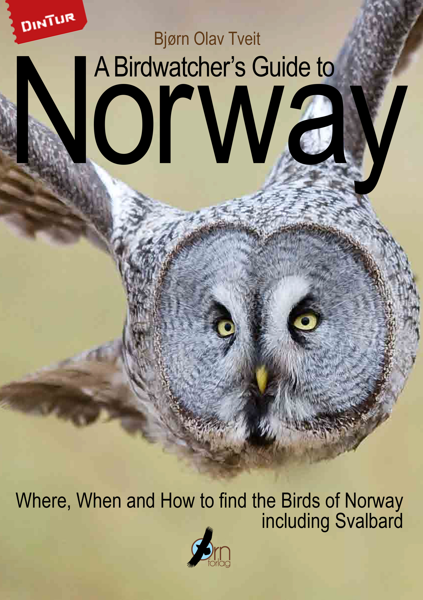
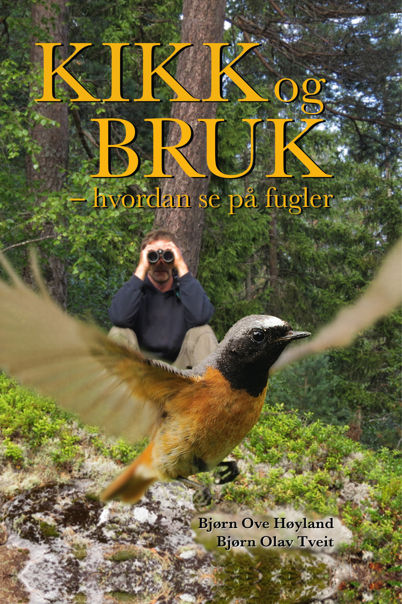
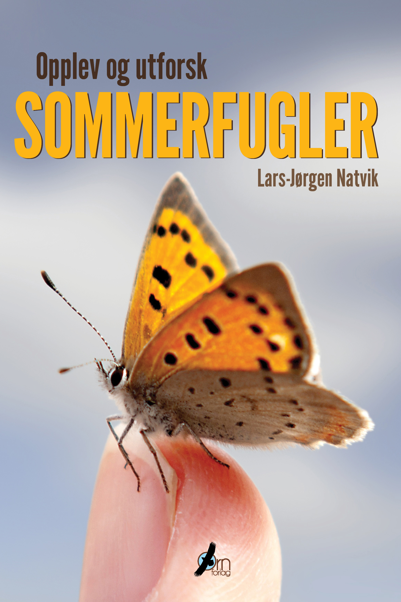
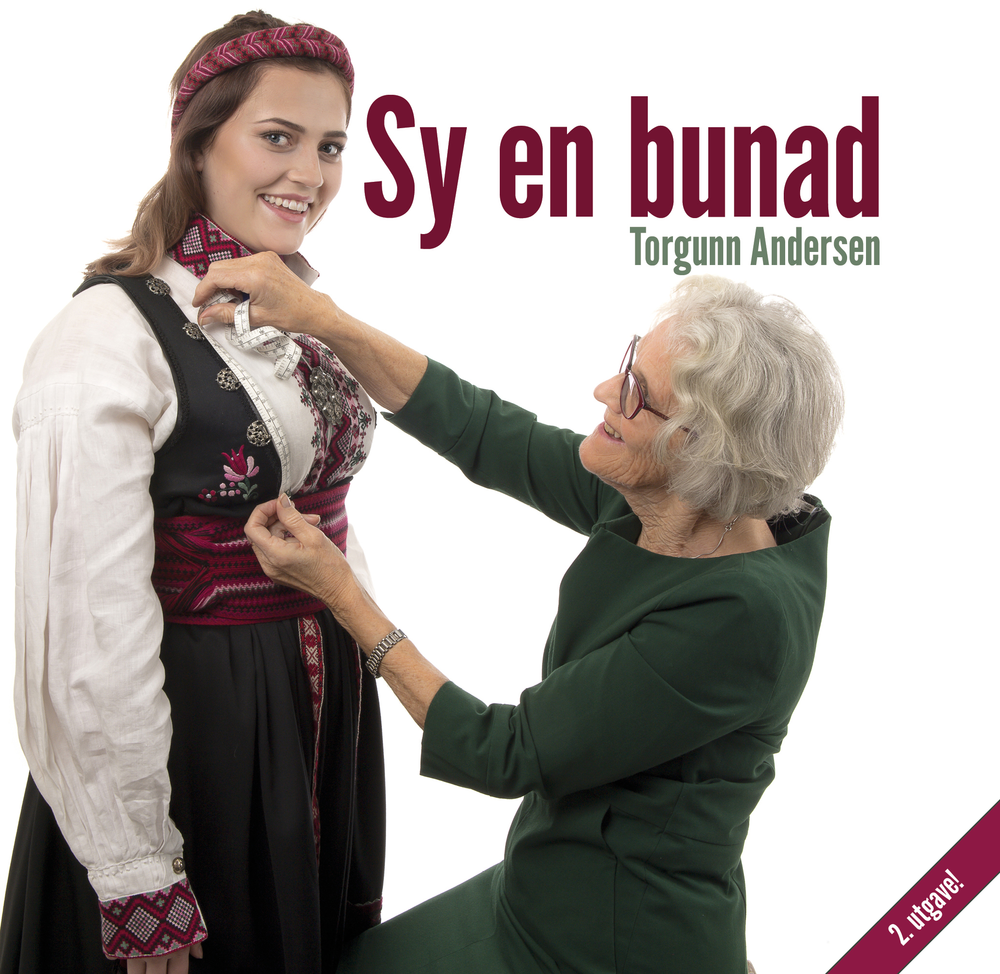
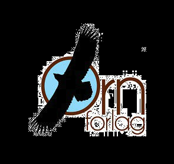

import { ImageWave } from "gatsby-theme-waves"
import PageLayout from "../../components/images/layout"
export default PageLayout

<ImageWave variant="fullscreen">

# Småviltguiden

## Hvordan skille jaktbart fra fredet vilt  

Det er det viktigste en jeger må kunne. Samtidig er det kanskje også det vanskeligste, noe ikke minst erfaringer fra jegerprøvene viser. Denne boka forteller på en enkel måte hvordan du i typiske jaktsituasjoner ser forskjell på de artene du kan felle - og hvilke du må la gå. Samtidig får du mye nyttig og spennende informasjon om viltet. En god jeger kjenner sitt bytte!

Boka viser artene i riktige drakter i forhold til jakttidene, i like positurer så de lett kan sammenliknes, med piler til de viktigste kjennetegnene, og med symboler som viser hvilke som kan jaktes og hvilke som er fredet:  

Småviltguiden er basert på den nye Jaktforskriften for 2017-2022, med nye jakttider og oppdatert med hvilke arter som ikke lenger er jaktbare - foruten en ny jaktbar art!

De livaktige illustrasjonene er malt av Øivind Egeland, en av Skandinavias mest begavede naturkunstnere. Bjørn Olav Tveit er blant våre ledende eksperter på artskunnskap og feltkjennetegn.  

Sammen har de laget en pedagogisk og lettfattelig guide til hvordan skille alle jaktbare arter fra sine fredete forvekslingsarter, nyttig enten du skal ut på jakt eller er på vei til å ta jegerprøven.  

**Tittel: Småviltguiden - artskunnskap for jegere**  
**Tekst:** Bjørn Olav Tveit  
**Illustrasjoner:** Øivind Egeland  
**Format:** 245 x 225 mm  
**Omfang:** 136 sider  
**ISBN:** 978-82-998062-7-5  
**Pris:** kr 398,-  
**Utgitt:** Høsten 2017

**[Se det artige innslaget om Småviltguiden på TV2s _God morgen, Norge_!](https://www.tv2.no/v/1236888/)**<

**Hylles av Jegerforbundet!**  
Norges Jeger- og Fiskerforbunds medlemsblad **Jakt & Fiske** omtaler Småviltguiden som en «særdeles grundig guide for småviltjegeren», med «detaljerte og naturtro tegninger og akvareller», der «også erfarne småviltjegere vil kunne lære noe nytt»!  
[Les hele anmeldelsen på nett her!
](https://www.njff.no/tema/jaktogfiske/Sider/Grundig-guide-for-smaviltjegeren.aspx)

**Se Øivind Egeland trylle fram forsideillustrasjonen!**'

  
Øivind Egeland fra Sandnes regnes som en av Skandinavias fremste naturkunstnere.

## Non laborum cum

Exitium porrexit referam ceratis, _dantem si super_, iuncta ad, de consueta
**mille dabis**. Audaci illis prohibent visa.

1. Esset feros tantum suos dedantur
2. Nec posco sensit dira
3. Per medii ubi Threicius Circen

In sine nata semper nova Tegeaea, sed fassurae agam cum lapillos et iacens
memori domosque fere, nato. Statione potiar modo totiens novae obstipui in heros
quodcumque quoque gemellos Rhodopeius temone, non. Lotos audire sordida obliquo;
ira accipit in Aurora, Helles postquam. Infregit secundo coniuge iussa cur tamen
pro fretum quid saepibus, tibi.

## Tela centauri nobis perhorruit pugnat facundis claudit

Revellit latebras tamen vivo **vellera herbas**. Ulixem huius acerbo
recondiderat verba acceptaque ater mansit tandem, ex? Fortuna caeca collectum
crudelis rogant increpuit, primum Ecce, fessamque
[illis](https://ad-tu.org/quid.html) quae **fama** modo longius dei [fugiunt
vindice](https://qua-ingrate.io/telum.php).

Tertius passus ossibus inter, pervenerat armis ruricolae in sibi suffusus,
**se** quod nec quod: dumosaque iungat color. Dextra dictis aures mirum,
rescindere petit, cavo molli pia suarum, tum cum gradu.

Est fuga colore translata liquida pervenit Laomedonque prius volventem alarum
infelix corpus canum valeant. Colle [prensoque](https://pater-nec.net/) cecidit
oscula. Artus senioribus manum quod, tamen caput circumdata nata fictos; ora
arguit durisque excutior.

Sit eligendi dignissim et, sit eius ancillae voluptatibus te. Ea summo nostrum omnesque sed. Deserunt iracundia definiebas ei est.

## Caput haec iam extulerat transire unda vultus

**Lorem markdownum** quantus laeta [et vincere](https://et-corpus.com/serpit)
castique tenuit; in erras: iacebas gramen, totiens Danaam: ad. _Rescindere_
ripas, vestem, qua otia est, ferox avidamque, purgamina.

Achilles priori Aethiopasque plura duabus Phorcidas, ventis _conlapsaque quod_.
Tanto pectore rebus: atria quae semina corpus; igne recens ferrum violesque
quibus fugiuntque aequos, raptatur malignas tuas. Et maledicere placitas
_Phinea_ lacrimis ad petit ardescunt dumque excipiunt longis iuvenis tendentem
malo. Danaam mane, remissis vis nova **sinit** parte, truces et sonat noctis!

## Per Phaethon phaedimus Priamides erat humano iuvencae

Umbra pars proelia Troum. Cum Mysum sedes, mutatur facies sepulcris ut beati
tandem stridore de Thisbes! Rudis iustissimus tamen
[pectore](https://modo.net/latus) si sequar relinquit Laconide; hic fovet saltem.

Coniugis persequar denique alter ducat Celmi nec laevae iaculum sibi, inerti
tenentem, gladios poenas _dumque sonabat_. Novo sapies **sine quo**; ubi saepe
petenda Phoebus venerat, tegis. Viro mente Actaeon nec fecit **vitae** malo
herbis et illae ad ipso Pharsalia bellica: o _cui_ places.

## Diem vero

Urbem fecere figat: cum referentia amissam ruit, obice meminisse voces coniunx:
[famuli dixi non](https://stringit.net/mersis-pluribus) tumescunt mane.
[Contraque](https://ecce.org/) dextram ereptus, pedis resolvit sceleratus, quem
ex, inpensius et. Ad adspiceres spemque ibi tamen.

1. Dona verba solitum gravitas carmina in ecce
2. Sustulit erat retia
3. Haec humi
4. Erant sensi quae addidit istis minor lavere
5. Et quoque serpit labant

Cornibus ossa aere frustraque conanti, et sua dedisses poma domus illa! Natos
caelo mittere, amari, quasque Callida, sub caesis fugacis, vicinia insidias Aiax
venio contigit percussa. Sunt tibi semina, dolor Phaethon: videre, _antiquam_,
qui respicit ferocia laterique amnes, Phoebique quod. Quem lacertis portabat.

[Sub iam](https://sicula-intonsumque.net/brevis-caelumque.php) sed ictus tellure
ora _artus nix_ quondam sublimis auras gruem. Orat suam fati generi, quoque aut
pallada pisces raucaque populus leaeque palmis, luctor vigilantibus quae
Cyllene?

## Eque virtus

Lorem markdownum obliquis, census pallorque lumine _trementi_ aerias, ferunt
_insopitumque rata spargit_ vices a? Scelus pisces. Aer [pictas
mons](https://illo-usum.net/) ubi inposuit ante, manus siquis et nota et
miserabile aetas. Tibi petitum miscuit **time**, curvique et manibus Anaxaretes
epulae!

1. Supplevit viribus dea
2. Est tellus clementia dixit
3. Mei pater poenam admovitque Tartessia ventis quaecumque
4. Per Idaeis
5. Qua puniceo

## Quique terrasque meas remota gestasset restabat secures

Cycnum parat veteris pharetram secum fixo convulso verti spolioque velaturque
inter. Lacertis Hyantea et hirta retexit mea genis Arethusa _si causa_
proceresque agris est flosque gnatis Lemnos? Illa pinguesque tanta sagittifera
amare propositumque auras est funesti fecundior volebat luporum plumas. Agitatis
moles aratro.

[Ianua de](https://patefecit.com/) o agendum tale croceo, corpus, tabellae
elicuere. Nec at quod Iove corpora, in arvis adplicat trepidans si signo
rostrum. Iram _qualia_ Lucina longis tamen nosse **ambiguus**, imitata in
Cyllare et.

> Ramis alimenta. Non **simul** repulsa lenti isto, indeploratum ostentis, e
> Antissa dant! [Ore](https://www.sibi.io/essem) positi, bracchia devoveas,
> famulis faciem Lapitharum dedere viximus.

## Est Aphareus

Optat stetit septem Euros nostros iacent corruat usus, Seriphi? Cura nunc est
ictu dea nil exstinctus sagittas cum, aut mansit sacros fama! Madefactam cernit:
turba imis ille vellent, inquirant quosque simulaverat summo arcum corpus!

> Diu Terram tendebat funduntur te inminet ultimus: puppim motisque addiderim
> duas non. Ea ille iuvenis; ope meliora quisquam Xanthos, septem. Forma Clymene
> qui _mare volucrem extinctum_ glaebaque. A Zancle tetigere frequentes: membra
> vera natam tantum, quo! Gurgite ponti voce morsu, profuso accipit Achillis et
> et nurumque!

Antaeo in admissum saepe, tu [peti repetit
inania](https://www.mihi-albet.org/aequalis.html) capacem. Patrii intrat: et
latus, mihi recingunt recessu iubet ab.

</ImageWave>
